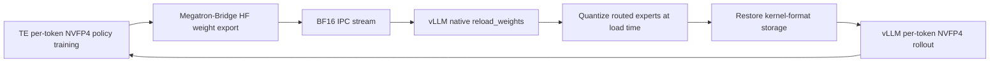

# End-to-End W4A4 NVFP4 with Per-Token vLLM Rollout

## Overview

NeMo RL provides an end-to-end W4A4 NVFP4 path in which selected routed-expert
MLP computations use per-token activation scaling during both policy training
and vLLM rollout on NVIDIA Blackwell GPUs. Transformer Engine (TE) performs the
training computation, and vLLM uses NVFP4 fused-MoE rollout kernels with the
same activation-scaling granularity.

The feature is designed around a reusable training-to-rollout contract: policy
workers retain BF16 source weights, refit transports BF16, and rollout workers
own quantization into their serving representation. Eligibility is determined
from the constructed vLLM model's routed-expert capabilities rather than an
architecture-name allowlist. See [Validated Configuration](#validated-configuration)
and [Current Limitations](#current-limitations) for the tested release boundary.

The model keeps BF16 master parameters and FP32 optimizer states. Attention,
routers, shared experts, embeddings, normalization layers, and selected
boundary layers remain in BF16. The policy backward pass currently uses TE's
dequantized path.

After every policy update, NeMo RL exports the updated BF16 weights to each
colocated vLLM engine. The rollout workers quantize routed-expert weights while
vLLM's native `reload_weights` API consumes the checkpoint-format stream before
the next rollout. Training remains unaware of the rollout representation.

## How It Works



### Per-token NVFP4 policy training

`policy.megatron_cfg.fp4_cfg` enables TE NVFP4, while
`te_precision_config_file` selects which modules use it. The provided precision
recipe applies NVFP4 only to routed-expert MLP linears and keeps attention,
dense MLPs, and shared experts in BF16.

`fp4_param` defaults to `false`, which keeps persistent model parameters in
BF16. NVFP4 is used for the selected forward computations, while the optimizer
continues to update the BF16 model through FP32 master parameters. FP8 and FP4
cannot be enabled together.

During policy training, per-token activation scaling gives each token its own
activation range. This reduces the effect of outlier tokens and matches the
activation granularity used by the rollout kernel.

### Weight refit

Megatron-Bridge exports the updated policy weights with Hugging Face parameter
names and reconstructs tensors across the training TP, PP, and EP topology,
sending plain BF16. This is the same transport representation used by a
BF16-only run.

Each vLLM engine receives the BF16 stream over CUDA IPC. NeMo RL converts each
transport batch into owned checkpoint-format tensors and supplies one lazy
iterator to vLLM's native `reload_weights` API. Routed-expert projections are
quantized at load time, mirroring the fp8/mxfp8 real-quant rollout path. NeMo RL
resolves the destination `RoutedExperts` container and classifies W1/W2/W3 from
that container's vLLM checkpoint mapping; it does not maintain model-family
projection names. W1 and W3 (often gate and up) share one per-expert global
scale, while W2 (often down) is quantized independently. BF16 boundary layers
pass through unchanged.

The IPC allocation is acknowledged only after quantization and passthrough
copies no longer depend on it. The final COMPLETE message is acknowledged only
after `reload_weights` consumes the entire stream, performs layerwise
post-processing, and completes the final device fence. If preparation or load
fails, NeMo RL drains and acknowledges the remaining IPC messages so the sender
cannot deadlock, and the rollout worker raises instead of serving stale
weights.

### Per-token vLLM rollout

NeMo RL configures vLLM with the `nvfp4_pertoken` quantization mode. During
refit, vLLM loads the packed expert weights, prepares them for the FlashInfer
fused-MoE runtime, and rebuilds the affected kernels. Rollout activations are
quantized dynamically for each token; no static activation calibration is
required.

The native reload path restores checkpoint-shaped parameters layer by layer,
loads and processes them, then copies the resulting kernel-format tensors back
into the storage used by CUDA graphs. A failed or incomplete refit stops the
rollout instead of continuing with stale weights.

## Configuration

The complete validated Qwen3-30B-A3B configuration is:

```bash
uv run examples/run_grpo.py \
  --config examples/configs/recipes/llm/grpo-qwen3-30ba3b-base-8n4g-megatron-te-nvfp4-pertoken.yaml
```

The feature-specific policy configuration is:

```yaml
policy:
  generation:
    colocated:
      enabled: true
    nvfp4_pertoken_rollout:
      enabled: true
    vllm_cfg:
      precision: bfloat16
      kv_cache_dtype: auto
      expert_parallel_size: 1

  megatron_cfg:
    moe_router_dtype: fp32
    fp4_cfg:
      enabled: true
      fp4: e2m1
    first_last_layers_bf16: true
    num_layers_at_start_in_bf16: 2
    num_layers_at_end_in_bf16: 4
    te_precision_config_file: examples/te_precision/attn_bf16_mlp_nvfp4.yaml
    env_vars:
      NVTE_NVFP4_ROW_SCALED_ACTIVATION: "1"
      NVTE_NVFP4_DISABLE_RHT: "1"
      NVTE_NVFP4_DISABLE_2D_QUANTIZATION: "1"
      NVTE_NVFP4_DISABLE_STOCHASTIC_ROUNDING: "1"
      NVTE_BACKWARD_OVERRIDE: dequantized
```

The rollout BF16 exclusions are derived from the effective
`first_last_layers_bf16`, `num_layers_at_start_in_bf16`, and
`num_layers_at_end_in_bf16` settings, so recipes do not duplicate layer paths.
For migration, an explicit `additional_ignore` is accepted only when it uses
complete `*.layers.<index>.mlp.experts*` patterns and exactly matches that
derived boundary.

## Validated Configuration

The shipped recipe captures the training and rollout settings used for the
end-to-end validation:

| Area | Validated setting |
|---|---|
| Model | Qwen3-30B-A3B-Base (`Qwen3MoeForCausalLM`) |
| Model layout | A routed-expert MoE block in every decoder layer |
| Hardware | 8 nodes with 4 NVIDIA GB200 GPUs per node |
| Algorithm and data | GRPO with DAPOMath17K training and DAPOMathAIME2024 validation |
| Sequence lengths | 2,048-token prompt and up to 20,480-token response |
| Global batch | 32 prompts with 16 generations each, for 512 sequences per step |
| Training parallelism | Megatron TP=2, EP=8, PP=1 |
| Rollout parallelism | Colocated vLLM TP=1, EP=1, PP=1 |
| Policy state | BF16 parameters, FP32 optimizer states, `fp4_param=false` |
| Router replay | `policy.router_replay.enabled=true`. Both measured runs and both shipped recipes enable it: keeping the training and rollout routers in agreement lets NVFP4 training stay stable for longer |
| Refit | BF16 CUDA IPC stream into native vLLM `reload_weights` |

The validation recipe is
`grpo-qwen3-30ba3b-base-8n4g-megatron-te-nvfp4-pertoken.yaml`, a long-running
configuration with periodic synchronous checkpoints. Short smoke coverage
remains available in
`grpo-qwen3-30ba3b-4n4g-megatron-te-nvfp4-pertoken-quick.yaml`.

## Current Limitations

The end-to-end contract is intended to support additional W4A4 per-token MoE
models, but this release has the following enforced or validated boundaries:

| Area | Current limitation |
|---|---|
| Model layout | Requires a vLLM `RoutedExperts` container with an unambiguous W1/W2/W3 checkpoint mapping; dense-only models are rejected |
| Quantized modules | Routed-expert MLP projections only; dense MLPs, attention, routers, and shared experts remain BF16 |
| Shared-expert fusion | A layout that fuses shared experts into the selected `RoutedExperts` container is rejected |
| Hardware and kernel | NVIDIA Blackwell with the FlashInfer TRT-LLM NVFP4 fused-MoE backend; GB200 is validated |
| Training precision | BF16 persistent parameters with `fp4_param=false`; backward computation uses TE's dequantized path |
| Rollout placement | Colocated vLLM rollout only; standalone evaluation is not supported because the dummy-loaded engine requires a refit first |
| vLLM parallelism | EP must be 1; the shipped end-to-end recipe uses TP=1 and PP=1; PP>1 requires the asynchronous engine |
| Cache and decoding | `kv_cache_dtype=auto`; speculative decoding is not supported |
| Refit transport | Default colocated CUDA IPC/ZMQ path (`refit_transport: null`) |
| Configuration | `generation.quant_cfg`, `generation.real_quant`, and explicit vLLM quantization/load-format overrides are mutually exclusive with this mode |
| Layer exclusions | Derived from the Megatron BF16 boundary; legacy `additional_ignore` must describe exactly the same complete expert layers |
| Algorithm coverage | End-to-end validation is GRPO only. PPO and distillation reuse the same Megatron training worker and vLLM refit path and are expected to work, but are unvalidated and warn at setup. The SingleController path is unsupported: it requires non-colocated rollout, which this mode rejects |

An additional architecture is eligible only when Megatron-Bridge can export its
HF-named BF16 weights and the pinned vLLM model exposes a complete compatible
`RoutedExperts` mapping. Constructed-model inventory and complete-refit checks
fail closed on unsupported method assignment, fused shared experts, incomplete
or duplicate projections, and incompatible block-16 tensor shapes. A new model
should still receive an end-to-end smoke before being listed as validated.

## Performance and GPU Memory

The following comparison uses Qwen3-30B-A3B-Base with DAPO on 8 nodes with
4 GB200 GPUs per node, a global batch size of 512, and a 20K response limit.
Training uses TP=2, EP=8, and PP=1; each vLLM engine uses TP=1. Both runs enable
router replay and are configured identically apart from rollout precision. All
values are medians over the 900 logged steps shared by the two runs.

| Metric | BF16 | NVFP4 W4A4 | Change |
|---|---:|---:|---:|
| Rollout generation throughput | 472.9 tokens/s/GPU | 661.4 tokens/s/GPU | 1.40x |
| Generation time | 220.5 s | 154.6 s | 1.43x faster |
| Observed step time | 276.4 s | 237.2 s | 14.2% lower |
| Token-normalized end-to-end throughput | 367.1 tokens/s/GPU | 421.1 tokens/s/GPU | 1.15x |
| Policy training throughput | 3,196 tokens/s/GPU | 2,681 tokens/s/GPU | 0.84x |
| Weight transfer and update | 1.8 s | 19.2 s | 17.4 s higher |
| Median response length | 5,608 tokens | 5,612 tokens | 1.00x |

Response length is matched between the two runs, so observed step time is
directly comparable and generation throughput is not inflated by longer
sequences. The gain comes entirely from W4A4 rollout. Two costs offset it:
policy training is slower because the backward path remains dequantized, and
refit is substantially slower than a BF16 weight transfer.

All three parts still have headroom. Refit is the largest and is profiled below.
Policy training will improve once the backward path runs natively in NVFP4. The
rollout numbers themselves were measured with conservative quantization-kernel
settings, so generation has room to improve as well. The end-to-end figure
therefore understates what this path can reach; see the roadmap.

NVFP4 stores each quantized weight using an E2M1 value, one E4M3 scale per
16-value block, and one FP32 global scale per tensor. Excluding the small
per-tensor scale overhead, this is approximately 4.5 bits per quantized weight,
compared with 16 bits for BF16.

Both runs set `gpu_memory_utilization=0.5`. The vLLM logs report the following
rollout memory values for each TP=1 engine:

| Rollout memory | BF16 | NVFP4 W4A4 | Change |
|---|---:|---:|---:|
| Model weights | 56.88 GiB | 18.07 GiB | 68.2% lower |
| Available KV cache | 30.37 GiB | 79.70 GiB | 2.62x |
| KV cache token capacity | 331,744 | 870,560 | 2.62x |

These values describe the vLLM rollout model and KV cache, not the peak memory
of the complete colocated RL process. Process-wide GPU samples also include TE
training workspaces, quantization buffers, and allocator caching, and did not
show a lower end-to-end peak in this comparison. The current result therefore
demonstrates lower rollout weight memory and greater KV-cache headroom, rather
than lower peak memory for the full training process.

Profiling the vLLM-side path showed that native weight loading, rather than IPC
transfer or NVFP4 arithmetic, dominates refit time:

| Refit phase | Representative time | Approximate share |
|---|---:|---:|
| vLLM load and layer processing | 13.13 s | 75% |
| NVFP4 quantization | 3.80 s | 22% |
| IPC wait and other work | 0.66 s | 4% |
| Finalization after all layers load | approximately 0 s | approximately 0% |

The load phase is Python-call-bound. Qwen3-30B-A3B emits 64,512 per-expert
checkpoint names per refit across 42 quantized layers and 128 experts, and each
name passes through vLLM's mapping, loader, and layerwise-reload bookkeeping.

A research-only prototype coalesced those outputs into eight full fused-expert
parameters per layer. In paired 90-step runs, the final per-expert path measured
18.42 seconds mean and median refit time; the prototype measured 6.31 seconds
mean and 6.38 seconds median, a 2.92x improvement. Both runs completed
successfully. The prototype is not part of this feature because complete
fused-parameter loading depends on vLLM's internal expert layout and should be
implemented upstream. The proposal and reproducible evidence are tracked in
[vLLM issue #53687](https://github.com/vllm-project/vllm/issues/53687), in
coordination with vLLM's streaming quantization-unit RFC
[#53192](https://github.com/vllm-project/vllm/issues/53192).

Refit remains a visible part of the step and an optimization target.

## Training Quality

The two runs above, over their first 900 shared steps:


Reward, response length, and validation accuracy track the BF16 baseline, and
entropy does not collapse. The train-rollout logprob error stays near its ideal
value of 1.0 for both runs. Generation KL error is higher under W4A4, which is
the expected cost of a quantized rollout and is the metric to watch when
extending this path to other models. The two throughput panels show the same
tradeoff as the table: faster rollout, slower policy training.

Longer stability validation is ongoing.

## Roadmap

- Reduce refit latency through the native layer-fused MoE parameter loader
  proposed in [vLLM issue #53687](https://github.com/vllm-project/vllm/issues/53687)
  and quantization before the expert-parallel gather.
- Add end-to-end coverage for more mapping families and hybrid dense/MoE
  layouts, including supported PP stages with no local NVFP4 targets.
- Add native NVFP4 backward computation.
- Complete longer stability and model-quality studies and publish the training
  curves.
