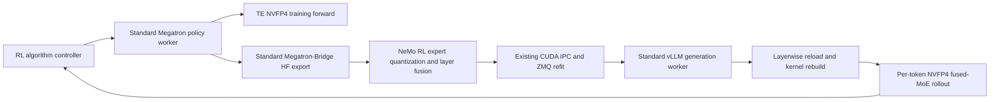

# Transformer Engine NVFP4 Training with Per-Token vLLM Rollout

NeMo RL supports an experimental W4A4 path that uses Transformer Engine (TE)
NVFP4 for Megatron policy training and dynamic per-token NVFP4 activation
scales for vLLM fused-MoE rollout. The path reuses the standard Megatron and
vLLM workers and does not require ModelOpt quantization-aware training state,
calibration, or a separate worker type.

During each refit, the standard Megatron-Bridge conversion produces
Hugging-Face-named weights. The Megatron policy worker quantizes routed-expert
weights into the NVFP4 checkpoint representation and fuses them per layer for
transport. The vLLM worker expands the transport representation, loads it
through vLLM's layerwise-reload lifecycle, and rebuilds a fused-MoE kernel that
derives activation scales independently for every token.

For the user-facing configuration entry point, see
[Quantization-Aware RL](../guides/quantization-aware-rl.md).

## Motivation

The existing ModelOpt QARL flow owns quantizer state and can export calibrated
or weight-only deployment formats through its dedicated integration. TE-native
FP4 training has a different contract: quantization is selected through
Megatron's transformer configuration and per-module precision recipe, without
ModelOpt calibration metadata.

This feature connects that TE training contract to a real W4A4 rollout while
keeping the policy and generation architecture unchanged.

| Goal | Design choice |
|---|---|
| Use TE NVFP4 in policy training | Add a strict `fp4_cfg` and load Megatron's per-module precision recipe |
| Match rollout activation granularity | Build the vLLM fused-MoE kernel with dynamic per-token activation scaling |
| Avoid a second policy or generation worker | Add mode-specific hooks to the standard workers |
| Keep refit payload practical | Quantize on the policy worker and transport six fused tensors per expert layer |
| Protect existing modes | Validate the feature at setup and leave all disabled-mode paths unchanged |

The first version intentionally does not provide a general-purpose NVFP4
plugin system, ModelOpt compatibility layer, arbitrary model support, or an
alternative refit transport.

## Architecture



The algorithm controller still calls the existing policy and generation
interfaces. Quantization changes the representation inside the refit stream;
it does not introduce a new controller path or Ray worker class.

### Component responsibilities

| Component | Responsibility |
|---|---|
| Transformer Engine | NVFP4 policy forward and dequantized policy backward |
| Megatron Core | FP4 configuration, per-module precision matching, and sequence-alignment requirements |
| Megatron-Bridge | Standard Megatron-to-Hugging-Face naming and TP/PP/EP reconstruction |
| NeMo RL policy worker | Expert selection, NVFP4 weight quantization, layer fusion, and refit streaming |
| NeMo RL vLLM integration | Strict mode validation, quantization registration, fused-tensor expansion, and reload lifecycle |
| vLLM and FlashInfer | Runtime tensor layout, fused-MoE execution, and dynamic per-token activation scales |

## Policy training

The policy enables TE FP4 through `policy.megatron_cfg.fp4_cfg`:

```yaml
policy:
  megatron_cfg:
    fp4_cfg:
      enabled: true
      fp4: e2m1
      fp4_recipe: nvfp4
      fp4_param: false
    te_precision_config_file: examples/configs/te_precision/attn_bf16_mlp_nvfp4.yaml
```

The validated precision recipe keeps attention input and output projections in
BF16 and applies NVFP4 to MLP linears. This matches the rollout scope, where
only routed experts are quantized. Selected first and last transformer layers
may also remain in BF16.

NeMo RL uses a conservative 128-token alignment for FP4 packed sequences in
the TE block-scaled GEMM path. FP8 and FP4 cannot be enabled together.

`NVTE_BACKWARD_OVERRIDE=dequantized` is valid for the policy backward pass but
not for inference-only policy forwards such as log-probability calculation.
The standard policy worker therefore removes it from the process-wide
environment and restores it only around training forward/backward calls. This
behavior is active only when `fp4_cfg.enabled` is true.

The validated recipe also enables row-scaled NVFP4 activations and disables
random Hadamard transforms, 2D quantization, and stochastic rounding. These TE
environment settings pin the training-side numerical contract used by the
per-token rollout smoke test; they are not applied as global NeMo RL defaults.

If first/last layers are kept in BF16, the matching complete expert layers must
also be listed under rollout `additional_ignore`. The policy worker warns when
a training-side BF16 boundary layer is not covered by that rollout list.

## Refit representation

The implementation wraps the existing policy export iterator after
Megatron-Bridge has produced Hugging-Face names. It does not replace
Megatron-Bridge conversion or distributed topology handling.

For every selected expert layer, the producer:

1. collects the numbered `gate_proj`, `up_proj`, and `down_proj` weights;
2. stacks experts and concatenates gate and up projections into W13;
3. computes one global W13 scale per expert and quantizes block-16 values;
4. emits packed weights, E4M3 block scales, and FP32 global scales;
5. fuses ignored BF16 expert layers into gate/up and down 3D tensors; and
6. passes every non-expert tensor through unchanged.

| Transport tensor | Dtype | Logical contents |
|---|---|---|
| `w13_weight` | `uint8` | Packed gate and up weights |
| `w13_weight_scale` | `float8_e4m3fn` | Block-16 W13 scales |
| `w13_weight_scale_2` | `float32` | Shared gate/up global scale per expert |
| `w2_weight` | `uint8` | Packed down-projection weights |
| `w2_weight_scale` | `float8_e4m3fn` | Block-16 W2 scales |
| `w2_weight_scale_2` | `float32` | W2 global scale per expert |
| `gate_up_proj` (ignored layers) | `bfloat16` | Fused gate/up expert weights |
| `down_proj` (ignored layers) | `bfloat16` | Fused down-projection expert weights |

Fusing each layer into six transport tensors is an IPC optimization, not a new
checkpoint format. Sending every expert projection separately would create
tens of thousands of per-tensor handshakes for a large MoE model. Immediately
before `model.load_weights`, the vLLM extension expands the tensors into the
per-expert names accepted by vLLM's routed-expert loader. The expansion creates
views and does not duplicate the packed payload.

Ignored expert layers use vLLM's native BF16 fused checkpoint names and remain
as two 3D tensors per layer. The ignore list controls quantization; it does not
reintroduce per-expert transport overhead.

The producer is implemented with PyTorch and has no vLLM import because
Megatron and vLLM run in isolated environments. Its packed values and scales
are tested bit for bit against vLLM 0.26's native online NVFP4 weight
quantizer.

The current export is post-EP: Megatron-Bridge reconstructs the BF16 expert set
before NeMo RL quantizes it. Moving quantization before the expert-parallel
gather requires a separate, general Megatron-Bridge export hook and is outside
this change.

## vLLM rollout

The vLLM integration registers `nvfp4_pertoken`, a constrained quantization
configuration based on vLLM's stock ModelOpt NVFP4 fused-MoE method. The name
describes the runtime format; the policy does not use ModelOpt QAT.

The generation model starts with `load_format=dummy` because a BF16 checkpoint
cannot initialize NVFP4-shaped runtime parameters. NeMo RL's colocated
training lifecycle always performs a complete refit before the first rollout,
and setup rejects standalone evaluation for this mode.

On every load, the worker extension:

1. enters vLLM's layerwise-reload lifecycle;
2. restores checkpoint-layout storage;
3. expands and loads the fused transport tensors;
4. sets neutral stored input scales because activations are scaled dynamically;
5. converts weights to the FlashInfer TRT-LLM runtime layout;
6. rebuilds the fused-MoE kernel with `per_token_activation=True`; and
7. synchronizes the device before acknowledging reusable IPC buffers.

Reloaded scale tensors are made contiguous so vLLM can copy converted values
back into stable storage referenced by CUDA graphs. A refit error is fatal in
this mode because continuing with dummy, incomplete, or stale expert weights
would produce invalid rollouts.

## Why weights are quantized on the policy side

vLLM 0.26 can accept BF16 MoE weights and quantize them online. That path is
useful for loading an ordinary checkpoint, but using it for every NeMo RL refit
would keep the larger BF16 transport payload and move repeated quantization
into every rollout worker. It would also require broader changes to the vLLM
reload path.

The selected producer uses the same numerical operation while preserving the
existing named-tensor transport and worker isolation. This keeps the change
local to two optional hooks and sends the already packed representation. The
native online quantizer remains the independent correctness oracle in unit
tests.

## Configuration and validation

Enable the mode under the existing vLLM generation configuration:

```yaml
policy:
  generation:
    nvfp4_pertoken_rollout:
      enabled: true
      additional_ignore:
        - "*.layers.0.mlp.experts*"
```

`additional_ignore` accepts only complete expert-layer patterns. Partial
expert or projection exclusions would make fused layer tensors internally
inconsistent and are rejected.

The initial validated scope is deliberately narrow:

| Setting | Supported value |
|---|---|
| Generation backend | vLLM, colocated, synchronous |
| vLLM parallelism per engine | TP=1, PP=1, EP=1 |
| Model layout | `Qwen3MoeForCausalLM`, every decoder layer MoE |
| KV cache | `auto` |
| vLLM model dtype | `bfloat16` |
| Refit transport | Default colocated CUDA IPC/ZMQ path |
| Speculative decoding | Disabled |
| Standalone evaluation | Not supported |
| ModelOpt generation keys | `quant_cfg` and `real_quant` must be unset |

These checks are setup-time failures rather than best-effort fallbacks. They
define the combinations exercised end to end and prevent silent use of an
incompatible loader or kernel. Enabling the rollout also requires the policy
contract shown above: BF16 master precision, E2M1 NVFP4, and `fp4_param=false`.

## Dependencies

| Dependency | Version or status | Reason |
|---|---|---|
| vLLM | 0.26.0 | Per-token NVFP4 fused-MoE kernel and layerwise-reload interfaces |
| FlashInfer | 0.6.14 | FlashInfer TRT-LLM MoE backend used by the per-token kernel |
| NVIDIA CUTLASS DSL | 4.6.0 | Required by the vLLM/FlashInfer runtime combination |
| Megatron-Bridge | Existing NeMo RL revision | No additional change is required for the post-EP design |

The generated `uv.lock` records the vLLM runtime upgrade and its transitive
dependency resolution.

## Alternatives considered

| Alternative | Decision |
|---|---|
| Dedicated quantized policy or generation worker | Rejected; both workers already expose the required configuration and refit extension points |
| ModelOpt QAT export | Not applicable to TE-native FP4 because no ModelOpt quantizer state or calibration metadata exists |
| vLLM online weight quantization for every refit | Not selected; it retains BF16 transport and requires a broader receiver-side change without a demonstrated end-to-end advantage |
| Pre-EP expert quantization | Deferred to a separate optimization because it requires a new Megatron-Bridge API and does not change the final vLLM payload or reload work |
| User-defined projection-level ignore patterns | Rejected because a partially quantized fused expert layer cannot satisfy the loader contract |

## Validation

The test strategy covers the representation boundary rather than only checking
that a short training command exits successfully:

| Layer | Coverage |
|---|---|
| Quantization math | Bitwise comparison with vLLM's native NVFP4 quantizer, shape validation, zero blocks, and 2D/3D equivalence |
| Refit producer | Expert grouping, shared W13 scale, complete-layer ignore, fused transport, expansion, and incomplete-stream failures |
| Training configuration | FP4/FP8 exclusion, 128-token alignment, precision-recipe matching, BF16 boundary layers, and scoped backward override |
| Generation configuration | Unsupported topology, model layout, evaluation, speculative decoding, and conflicting engine settings |
| Reload lifecycle | Stable parameter storage, fatal failures, and synchronization before IPC acknowledgment |
| End to end | Two GRPO steps on 4 nodes × 4 GB200 GPUs, covering initial and post-update refits plus finite training metrics |

The end-to-end run is a functional smoke test, not a convergence or throughput
claim. Longer accuracy and performance studies remain recipe- and
model-specific.

## Key implementation files

| File | Purpose |
|---|---|
| `nemo_rl/models/generation/vllm/quantization/nvfp4_pertoken.py` | vLLM-free producer, transport fusion, expansion, and HF quantization metadata |
| `nemo_rl/models/generation/vllm/quantization/nvfp4_pertoken_vllm.py` | vLLM quantization method and reload worker extension |
| `nemo_rl/models/generation/vllm/quantization/nvfp4_pertoken_config.py` | Strict shared configuration schema |
| `nemo_rl/models/policy/workers/megatron_policy_worker.py` | Optional standard-worker refit hook and training-only environment scope |
| `nemo_rl/models/generation/vllm/vllm_worker.py` | Optional standard-worker engine configuration |
| `examples/configs/te_precision/attn_bf16_mlp_nvfp4.yaml` | Attention-BF16 and MLP-NVFP4 precision mapping |

## Current limitations

- Only the validated Qwen3 all-MoE layout is accepted.
- vLLM TP, PP, and EP must each be one per rollout engine.
- The mode is limited to colocated synchronous training and generation.
- Attention, shared experts, routers, embeddings, norms, and output heads remain
  in their native dtype.
- Expert quantization currently happens after Megatron-Bridge's EP gather.
- Model initialization depends on the mandatory first refit and therefore does
  not support standalone evaluation.
